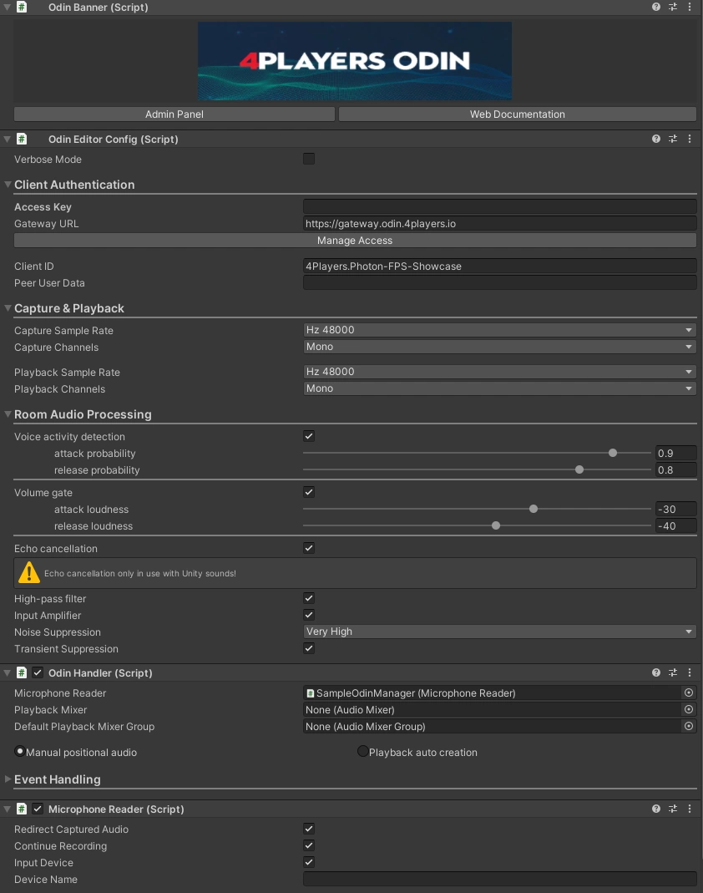
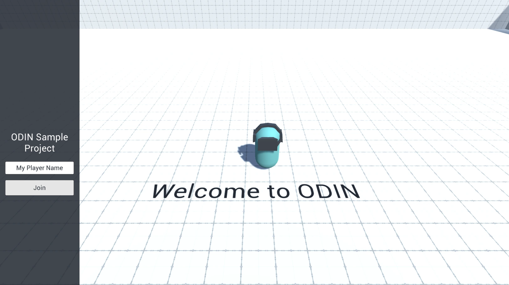
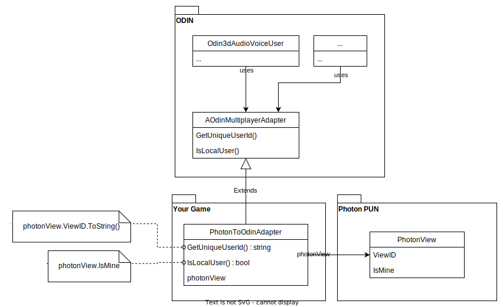
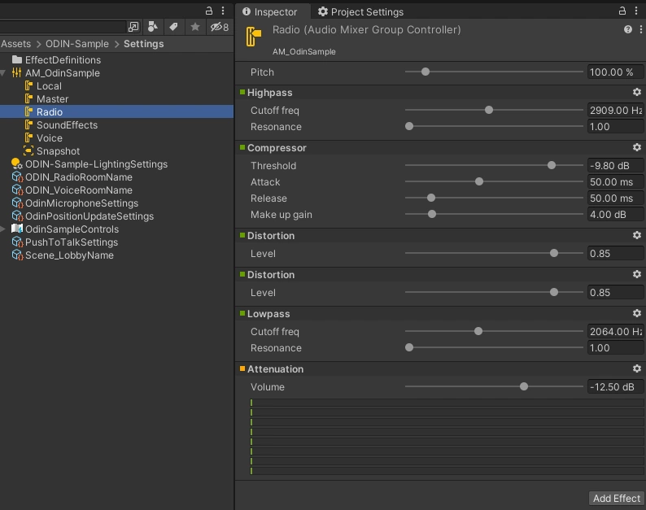
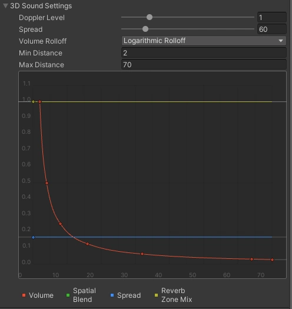
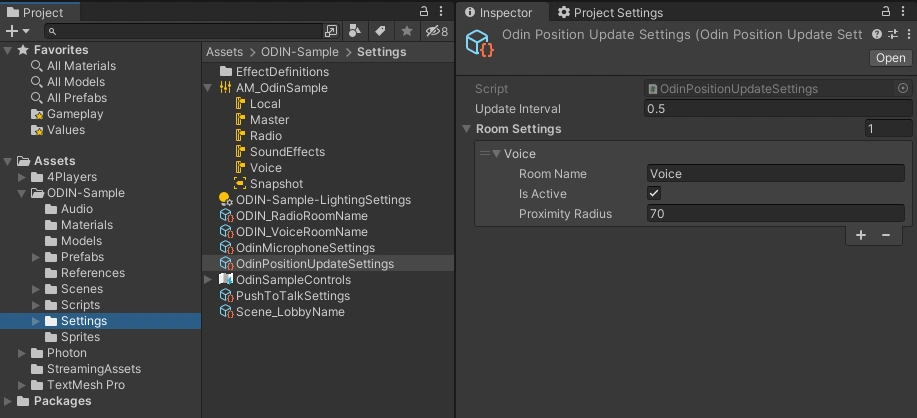
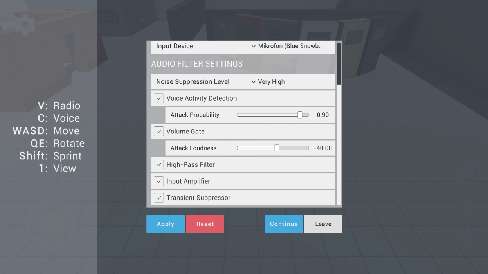
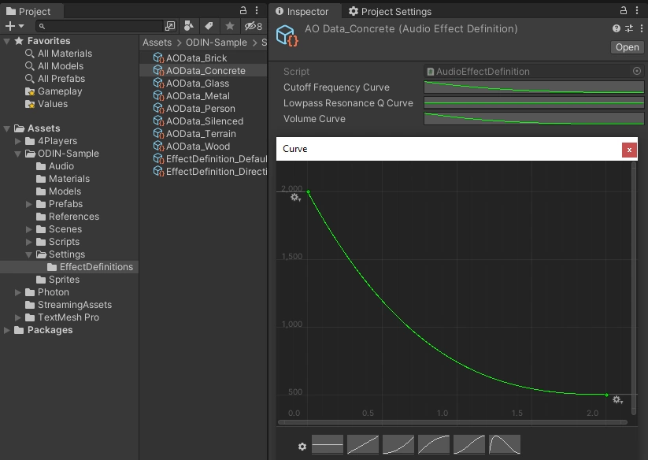
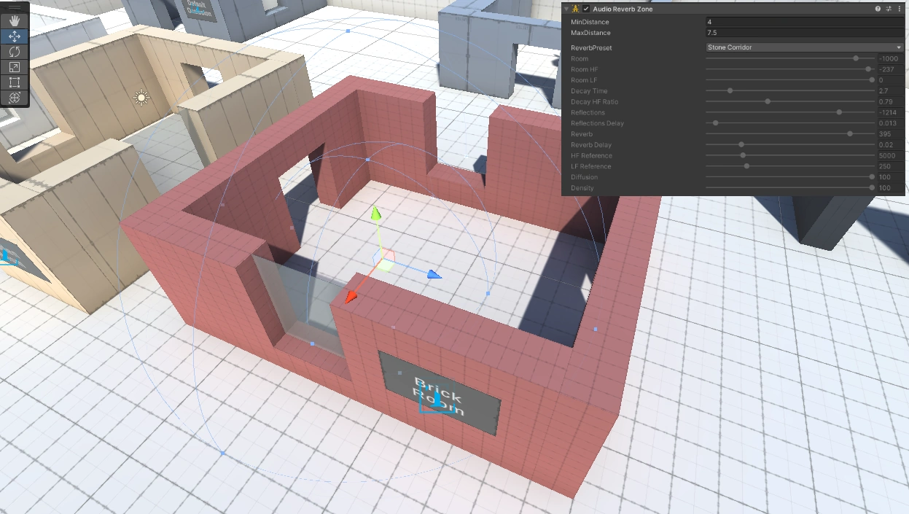

# ODIN and Atmoky Unity Demo Project

Please check out https://www.4players.io/odin/ for more info on ODIN.

Additional info on this demo project can be found here: https://www.4players.io/odin/guides/unity/pun-sample/.

This version extends the given Tech Demo by the [True Spatial Audio Solution by atmoky](https://atmoky.com/products/true-spatial/). This is a high quality solution for 3D Spatial Audio and thus integrates perfectly with the use cases of Odin.

## ⚠ Downloading the ZIP ⚠

**Please note**: This repository uses LFS. You need to clone this repo with LFS enabled. **Downloading the ZIP file via Githubs Download ZIP functionality does not work!**

To enable git lfs, enter `git lfs install` in your git bash in your local repository.

## Opening and Starting the Project

To open the project you will need to **download the current version of Atmoky for Unity first**.

- Go to atmoky's [download page](https://developer.atmoky.com/true-spatial-unity/downloads) for their Unity integration
- Fill out their form
- You will receive an email containing a download link of their Unity Package
- Unzip the Package and add it to the `ODIN-SampleProject/Package`

Now you can add the project to Unity Hub and open it like usual.

# ODIN Demo: Extended Audio System and Multiplayer with Photon PUN 2
In this guide we’ll walk you through the basic concepts of integrating ODIN into a multiplayer game. This demo will use
the Photon PUN 2 multiplayer framework, but ODIN can be integrated into your game using any multiplayer solution or
even without multiplayer. The ODIN-Demo itself also allows us to easily switch out Photon for another framework.

If you are unsure why you should use ODIN for that, learn more about our features and what makes us special in our [introduction](https://www.4players.io/odin/introduction/).

## Project Structure

The ODIN-Demo project's scripts are split up into the categories:
- **ODIN:** Handles anything related to core ODIN-features, without external dependencies. If you'd like to use a multiplayer framework other than Photon, you can safely reuse the files contained in this assembly.
- **Photon:** Anything Photon specific is contained in here, like joining Photon Rooms or synchronizing Player Position.
- **GameLogic:** Anything else required for the demo, like the player's movement or view state (1st-person or 3rd-person).

You can find demo settings in the `Assets > ODIN-Demo > Settings` directory, e.g. settings for the occlusion effects, ODIN room names, Push-To-Talk settings and Input definitions. Any prefabs used in the demo can be found in the `Assets > ODIN-Demo > Prefabs` directory, with the player prefab being located in the `Resources`.

The demo scene's hierarchy contains three root game objects used for categorizing behaviours:
- **Environment:** Contains all visible objects or lights that contain the scene's visuals.
- **Gamelogic:** Behaviours like the `PhotonPlayerSpawner` or the ODIN room join logic are placed here.
- **UI:** The root object for in-game UI, like the settings menu or the radio room's active user display.

## ODIN terms and behaviours

This is a short introduction into the most important ODIN terms - for more in-depth information [please take a look at the ODIN documentation](https://www.4players.io/odin/introduction/).

### Rooms, Peers and Media

Every client connects to an ODIN server, authenticates with an access token and joins a room. Once the client has joined a room, they are a peer inside the ODIN room. Every peer can add media to that room, linked to a physical device like a microphone. Clients can join multiple rooms at the same time and can add multiple media streams at the same time.

To find more information on the basic ODIN topology, [please take a look at the Basic Concepts documentation](https://www.4players.io/odin/introduction/structure/).

### OdinHandler

The OdinHandler script is a singleton behaviour, wrapping the functionality of the native ODIN SDK for use in Unity. You can access the script via `OdinHandler.Instance`. 

The most important use-cases are the `OdinHandler.Instance.JoinRoom` method for joining ODIN rooms and the events for listening for ODIN events, like `OnRoomJoin`, `OnPeerJoined` and `OnMediaAdded`. To use the `OdinHandler`, make sure to add a variant of the `OdinManager` prefab into your project. The prefab also contains the `OdinEditorConfig` script, which allows us to set the Access Key and Room Audio Processing settings in the inspector.

If you don't yet have an ODIN subscription and just want to test out ODIN's functionality, you can use a generated key by pressing the __Manage Access__ Button and then selecting __Generate Access Key__. The resulting access keys can be used to access the ODIN network with up to 25 concurrently connected users free of charge.




### PlaybackComponent

The ODIN SDK provides the `PlaybackComponent` script to easily play back audio data received from
the ODIN server. Each `PlaybackComponent` represents one media stream and is identified by a media id, a
peer id and a room name.

### User Data

Every peer in Unity can store arbitrary information as user data. When local user data is updated, the server updates user data on all clients. Read more about user data in the guide: [Understanding User Data](https://www.4players.io/odin/guides/unity/user-data/).

## Multiplayer

### Lobby

Because ODIN works framework independent, we won't go too much into detail on how to set up Photon - for an in-depth explanation, [please take a look at Photon's starter guide](https://doc.photonengine.com/en-us/pun/current/getting-started/pun-intro). 

**Note:** When first entering the Unity project, Photon will require you to add an App Id - simply follow the instructions to add or create your own App Id.



We wait for a connection to the photon network, before allowing users to join a Photon room. In the demo we'll simply add all players to the same room. We also use the `PhotonNetwork.AutomaticallySyncScene = true` option to automatically load the correct scene for each player joining.

After pressing the `Join` Button, the player will either connect to an existing Photon room or create a new Photon room as a Master Client. As a master client, we'll use the call: 
```c#
    PhotonNetwork.LoadLevel(sceneToLoad);
```
Otherwise Photon will automatically load the correct scene.

### Demo Level

When entering the Demo Level scene, two things happen:

1. We instantiate the player over the Photon network using `PhotonNetwork.Instantiate` and the `ODINPlayer` prefab. This is kicked off by the `PhotonPlayerSpawner` script on Start. **Note:** The player prefab needs to be located in a `Resources` subdirectory, in order for Photon to be able to instantiate the player correctly.

2. We automatically connect to two ODIN rooms (Voice and Radio) with 

```c#
OdinSampleUserData userData = new OdinSampleUserData(refPlayerName.Value);
OdinHandler.Instance.JoinRoom(refRoomName.Value, userData);
```

We don't have to send user data when joining an ODIN room, but in this case we already have access to the player name from the value entered in the Lobby scene, so it makes sense to supply it while joining.

`OdinSampleUserData` is a serializable C# class which implements the `IUserData` interface. This is a requirement for any userdata transmitted using ODIN. The interface member function `ToBytes()` simply provides an UTF8 encoding of a JSON representation of the class. The class contains app specific properties like the player's name, his capsule color and a unique user id. The unique user id is used to connect an ODIN media stream to a Photon View - specifically the unique user id is equal to the photon view id - and therefore required for the proximity chat.

## ODIN


### Global Voice Chat - Radio transmissions

In the demo project, users automatically join the ODIN room named _Radio_, in
which players can communicate as if using radio transmitters - when pressing down the `V` key, the microphone input
can be heard by all players in the room independent of their position.

For this scenario, the demo project provides the `OdinDefaultUser` script, which uses the 
`OdinHandler.Instance.OnMediaAdded` Event to spawn an instance of a prefab with a `PlaybackComponent` for
each media stream in the ODIN room. The event provides the room name, peer id and media id required
for the `PlaybackComponent` to work. 

We added the `OdinDefaultUser` script as a local-player-only behaviour - so it will only spawn Playbacks as children of the Player.
This doesn't matter for our radio transmissions, because they can be heard globally and shouldn't react to the distance between the
local Player and remote Players. It also ensures, that each radio stream will only be spawned once for the player. But it also
entails that the `OdinDefaultUser` script should only be used for ODIN rooms which do not make use of proximity voice chat. 

In the next paragraph we'll take a look at how the Tech Demo implements a Proximity Chat which reacts to the distance between local Player and remote Players. We'll also take a look at how to create the "Radio Crackling" Effect in paragraph [Playback Settings](#playback-settings---distance-and-radio-effects).


### Proximity Chat - connecting ODIN to the multiplayer framework

In a multiplayer scenario, we encounter the issue of connecting a user's ODIN media stream to the user's avatar
in the game, e.g. in our demo project we'd want a player's voice in the proximity chat to come
from the player's capsule. But because ODIN and the multiplayer framework don't know of each other's existence, we first have to logically connect the two concepts.

The abstract `AOdinMultiplayerAdapter` script gives access to the methods `string GetUniqueUserId()` and 
`bool IsLocalUser()`. This adapter is used to connect the player's representation in the multiplayer 
framework (using the framework's equivalent of an unique user id) to an ODIN peer. On ODIN's side we use 
custom user data to keep track of that id. When joining an ODIN room, the `AOdinMultiplayerAdapter` 
automatically sets the `uniqueUserId` of our custom ODIN user data for the current peer and sends an 
update to the other peers in the room. On receiving the update, those clients then use a reference to `AOdinMultiplayerAdapter` 
to compare the remote peer's `uniqueUserId` to the id supplied by the remote adapter's `GetUniqueUserId()`.
If both ids are equal,we know that an ODIN peer is represented by the referenced `AOdinMultiplayerAdapter`.



In the demo project
we use this information to correctly play black the proximity chat audio at a player's location -
specifically using the `Odin3dAudioVoiceUser`, which automatically creates a `PlaybackComponent` for each remote user.

The demo project utilizes Photon as a multiplayer framework, so we add the
`PhotonToOdinAdapter` to our player. The adapter uses `PhotonView.ViewID` as a unique user id and
`PhotonView.IsMine`
to determine whether the adapter represents a local or a remote player. To switch out Photon for another
multiplayer framework, simply provide your own class extending `AOdinMultiplayerAdapter`.

### Playback Settings - Distance and Radio Effects

ODIN relies on Unity's `AudioSource` and atmoky's `AtmokySource` Components to play Media Streams. We can therefore just use the built in functionality of Audio Sources to adjust the distance at which players can hear each other. For any `AOdinUser` implementation (i.e. `OdinDefaultUser` for Radio transmissions and `Odin3dAudioVoiceUser` for Proximity Voice Chat) we can reference a prefab that will be spawned for each
Media Stream. These Prefabs not only have a `PlaybackComponent` on them, but also contain an `AudioSource`. So, to change the Playback Behaviour of Media Streams in-game, we have to change the `AudioSource` Settings on the prefab. Additionally there is an `AtmokySource` component that offers settings specific to the atmoky True Spatial audio renderer - e.g. directivity settings. The Tech Demo uses the prefabs `OdinRadioAudioSource` and `OdinVoiceAudioSource` in the `ODIN-Sample > Prefabs` folder. 

The `OdinRadioAudioSource` prefab simply has a full 2D `Spatial Blend` setting and the `Bypass Reverb Zone` enabled. The latter lets us avoid Unity's Reverb Zones, e.g. Echo effects in large rooms. The most interesting setting can be found in the `Output` option - here we reference an Audio Mixer Group Controller. The Radio Group Controller defines the list of effects that the incoming Radio room Media Streams go through, before being output to the User. The combination of these effects creates the Radio's crackling effect, giving Players a more immersive experience.



The `OdinVoiceAudioSource` prefab on the other hand has a full 3D `Spatial Blend` setting and does not bypass reverb zones - we want this `AudioSource` to simulate a human voice in the real world, which is naturally affected by the environment. The prefab uses the 3D Sound Settings of the `AudioSource` component to further specify this effect - the `Min Distance` value defines the distance at which the voice will be heared at full volume and the `Max Distance` defines the distance at which we won't hear the voice anymore.
Additionally we can see the `Volume Rolloff` set to `Logarithmic Rolloff` - this best approximates a real world setting. If required, the rolloff can easily be customized by choosing a linear or custom setting.



 These three options majorly define the fading behaviour of a player's voice in the distance - at least when there aren't any objects between the audio source and listener. Occlusion effects are not part of Unity's Audio System, but we've included our own, custom solution for this in the Tech Demo, which is explained in-depth in the [Audio Occlusion paragraph](#audio-occlusion).

### Proximity Chat - Room Optimization

Another feature of ODIN is, that the ODIN servers can automatically stop the transmission of Media Streams based on the spatial distance between the local player and other players in the ODIN room. This allows us to optimize the bandwidth required for each player, avoiding unnecessary downstreams for voice transmissions that can't be heard by the player due to distance anyway! Of course, we only want to use this for proximity-based ODIN rooms, not for global rooms like the Radio Chat.

To enable this feature, we use the methods 

```c#
room.SetPositionScale(scale);
```
and 
```c#
room.UpdatePosition(position.x, position.y);
```
As ODIN is not aware of the scale your game is operating at, it initially uses a Unit Circle as the cutoff radius. If we use the [previously mentioned](#playback-settings---distance-and-radio-effects) `Max Distance` to calculate `scale` as
```c#
float scale = 1.0f / MaxVoiceDistance;
```
we can automatically disable streams that wouldn't be transmitted by the `Audio Source` due to distance anyway. 

__Note:__ The position scale should be set to the same value for all Peers in the ODIN room. The scale value also has to be set individually for each room that will utilize ODIN's optimization feature.

For ODIN to be able to use the distance values for optimization, we have to transmit player positions at regular intervals. The function `room.UpdatePosition` lets us define the client's current position in the room. If we define the correct room scale, we can simply use the player's `transform.position` x and z values. 

 __Note:__ For now, we can only transmit 2D positions with this method. But as most games have a wide horizon and aren't scaled vertically, this is not a real drawback.

 In the Tech Demo, the `OdinPositionUpdate` component regularly updates the player's position. Using entries to the Room Settings array on the `OdinPositionUpdateSettings` scriptable object, we can define the activation status and the cutoff radius for each ODIN room individually.

 

### Push-To-Talk

Push-To-Talk is handled by the `OdinPushToTalk` script using settings defined in a `OdinPushToTalkSettings` scriptable object. If the push-to-talk button for a specific room is pressed, the script will access the user's mediastream and set a user's mute status using `targetRoom.MicrophoneMedia.SetMute()`.

The `OdinPushToTalkSettings` scriptable object allows rooms to be either be voice-activated or require a button press to talk - if you'd like to make this available as a user-setting, you can use the `OdinPushToTalkSettingsController`, which automatically sets the room's activation method based on a Unity Toggle. Take a look at the Tech Demo's `Settings` prefab (found in `ODIN-Sample > Prefabs > UI`) for more information.


### Audio Filter Settings

The ODIN SDK provides quite a few Room Audio Processing settings, like Voice Activity Detection, Echo Cancellation, Noise Suppression levels and more. If you're content with using the same settings for all users, you can simply adjust the values on the `OdinManager` prefab ([as shown here](#odinhandler)). 

The Tech Demo has a sample implementation on how to allow users to adjust these settings in the game. The `Settings` prefab (found in  `ODIN-Sample > Prefabs > UI`) uses Unity's `Toggle`, `Slider` and `Dropdown` UI components to adjust the Audio Settings. The `OdinAudioFilterSettingsController` script contains entries that map the UI component's input to ODIN's filter values and even stores the changes to file. For a fast integration into your game, you can use the Tech Demo implementation and adjust the UI graphics to your liking.

 


### Choosing an Input Device

The previously mentioned `Settings` prefab also allows players to choose their input device. The options that are available are based on Unity's `Microphone.devices` ouput and displayed in the dropdown component. Updating the input device used by ODIN is then as simple as calling

```c#
MicrophoneReader microphoneReader = OdinHandler.Instance.Microphone;
microphoneReader.StopListen();
microphoneReader.CustomInputDevice = true;
microphoneReader.InputDevice = selectedDevice;
microphoneReader.StartListen();
```
where the `selectedDevice` is one of the string options listed in the `Microphone.devices` array. The Tech Demo uses the implementation in the `OdinMicrophoneController` script, which also handles saving and loading the users selection in previous game sessions.


## Audio

To better showcase the capabilities of ODIN in apps and games, we've implemented some audio
features that are often used in games, but not included in Unity's Audio System: Audio Occlusion and Directional Audio. Because we want to keep things simple and performant, we're going to approximate those effects, using Unity's ``AudioLowPassFilter`` component
and by adjusting the volume of individual audio sources.

### Audio Occlusion

Audio Occlusion should occur when an object is placed between the audio listener (our player) and audio sources in the scene - e.g.
hearing the muffled sounds of an enemy approaching from behind a wall.
Unity does not have any kind of built-in audio occlusion, so we need to implement our own system. 
The `OcclusionAudioListener` script contains most of the occlusion logic and is placed, together with the `AudioListener` script,
on our local player object. The `OcclusionAudioListener` registers objects with colliders, that enter the detection range and have at least one `AudioSource` script attached in the transform hierarchy. By default the detection range 
is set to 100 meters - Audio Sources that are farther away than that are usually 
not loud enough to be affected meaningfully by our occlusion system.
We then apply the occlusion effects to each of the registered Audio Sources in every frame. 

Our occlusion effects have the parameters 
`Volume`, `Cutoff Frequency` and `Lowpass Resonance Q`:
- **Volume:** Multiplier for the audio source's volume.
- **Cutoff Frequency:** Removes all frequencies above this value from the output of the Audio Source. This value is probably
the most important for our occlusion effect, as is makes the audio sound muffled. The cutoff frequency can range
from 0 to 22.000 Hz.
- **Lowpass Resonance Q:** This value determines how much the filter dampens self-resonance. This basically means, the 
higher the value, the better sound is transmitted through the material the filter is representing. E.g. for imitating an iron
door, the `Lowpass Resonance Q` value should be higher than for imitating a wooden door.

The occlusion effect is based on the thickness of objects between our 
`AudioListener` and the `AudioSource`. For each audio source we check for colliders placed between the listener and the source using raycasts and
determine the thickness of the collider. This thickness value is then used to look
up the final effect values from an `AudioEffectDefinition` ScriptableObject. For each of 
the three parameters `Volume`, `Cutoff Frequency` and `Lowpass Resonance Q` the ScriptableObject
contains a curve, which maps from the collider's thickness on the x-Axis to the parameter value
on the y-Axis.

The image below shows an Audio Effect Definition Scriptable Object for the Concrete material. When selecting the `Cutoff Frequency Curve`, Unity's Curve Editor window shows up to allow finetuning the settings. The x-axis displays the thickness of an occluding object in meters. The curve then maps to the cutoff frequency displayed on the y-axis.



The `AudioEffectDefinition` is retrieved using one of two options:
- By placing an `AudioObstacle` script on the collider's gameobject. This can be
used to customize a collider's occlusion effect and give it a certain material's damping
behaviour. The demo uses the `AudioObstacle` to define the occlusion effect of a brick wall,
a wooden door, a glass pane or even a 100% soundproof barrier.
- By falling back to the default `AudioEffectDefinition` - this option is used, if no `AudioObstacle`
is attached to the collider. 

You can create your own `AudioEffectDefinition` by using the `Create > Odin-Sample > AudioEffectDefinition` 
menu in your project hierarchy. 

### Directional Audio

Unity's built in audio system allows us to hear differences between sounds coming from left 
or right, but not whether the object is in front or behind us. The `DirectionalAudioListener` script will take care
of this using basically the same effects as the audio occlusion system. 

Similar to the `OcclusionAudioListener`, we apply an effect to each Audio Source in 
the detection range - but instead of using the thickness of objects between source and listener,
we interpolate the effect based on the angle between the listener's forward vector and a vector
pointing from the listener to the audio source. 

Note: The implementation currently won't let us differentiate between sound coming from above or below. To implement this behaviour, 
please take a look at the implementation of [Head Related Transfer Functions (HRTF)](https://en.wikipedia.org/wiki/Head-related_transfer_function).


### Environmental Effects

The Tech Demo Level contains a few rooms, that highlight the Audio Occlusion effect for different materials. Additionally, we've used Unity's `AudioReverbZone` components to add environmental effects to these rooms, to further increase the players immersion. Unity provides a few presets which simulate different environments - e.g. the Demo Level's "Brick Room" uses the `Stone Corridor` preset - but also allows to be set to a custom arrangement. The effect will start to be heared at `MaxDistance` and is at full force inside of the `MinDistance` radius.
 
While the Voice transmissions are affected by the reverb zones, the Radio transmissions are not, due to the `Bypass Reverb Zone` setting on the Playback Prefab - as described [here](#playback-settings---distance-and-radio-effects).



## Game Logic

### Player Name and Color Synchronization

The `OdinNameDisplay` and `OdinSyncedColor` scripts use the ODIN's custom User Data to synchronize the player's name and avatar color. With `OdinHandler.Instance.OnPeerUserDataChanged.AddListener()` we listen to any changes on a remote peers User Data - if the peer's `UniqueUserId` equals the Multiplayer Adapter's `GetUniqueUserId()`, we read the name and display it above the peer's avatar using a world-space canvas and display the color on the avatar's mesh.

### Mobile Controls

Because ODIN works on mobile platforms, we've added mobile controls to the Tech Demo. The implementation is based on Unity's new Input System and allows players to move, rotate, use Push-To-Talk and switch from 3rd to 1st-person view with On-Screen controls. Take a look at the `UI > MobileControlsCanvas` in the DemoLevel scene's hierarchy for implementation details. The mobile controls can be simulated in Editor by selecting the `Enable in Editor` option on the `ActivateIfMobile` script. 


### Toggling the in-game radio objects

The `ToggleRadioBehaviour` script implements the basic behaviour for turning the in-game radio sources on and off - if an  avatar enters the detection radio, the controlling player will be able to toggle the radio status with a button press. The status then gets synchronized with the `PhotonRadioSynchronization` behaviour, which listens to the toggle's `onRadioToggled` UnityEvent.

If you'd like to implement another multiplayer framework, simply replace the `PhotonRadioSynchronization` with your own synchronization behaviour. 

### Switching Player Views

Users can switch from 3rd-person to 1st-person view on button press - this is implemented in the `ToggleViews` script by toggling game objects found in the `ODINPlayer > LocalPlayerBehaviours > ControllerState` hierarchy of the `ODINPlayer` prefab. The `FirstPersonBehavior` object contains the camera and behaviours for 1st-person controls, the `ThirdPersonBehavior` contains everything for 3rd-person controls.

